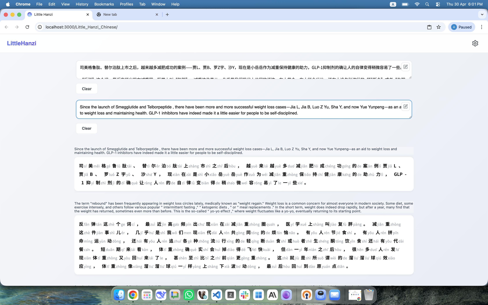

# LittleHanzi

Little hanzi is a nice simple that i created to make chinese learning process simple efficient and clean. It teches chinese via read articles. I was looking for something similar solution in the open source solution, and could not find any so i decided to create this for myself. Latter on i made it pubic so that if there is some else stuck in the same problem as me, They can use it.


## Screenshot



**Live Demo:** [Little Hanzi](https://amaan-samar.github.io/Little_Hanzi_Chinese/)
## What is this?

Little Hanzi lets you paste Chinese text and its English translation, then displays them side-by-side with pinyin pronunciation guides. Perfect for reading practice and vocabulary building.

## Features

- **Paragraph by paragraph reading** - Compare Chinese and English text
- **Pinyin support** - Toggle pinyin on/off above Chinese characters
- **Customizable** - Change font size, font family, and display order
- **Mobile friendly** - Works on phones and tablets
- **Works offline** - Install as PWA on your device
- **Settings save** - Your preferences are remembered

## Demo Content

The `/data` folder contains sample articles:
- `cn.txt` - Chinese text samples
- `en.txt` - English translations

Copy these into the app to see how it works.

## Setup

```bash
# Clone the repo
git clone https://github.com/Amaan-Samar/Little_Hanzi_Chinese.git

# Install dependencies
npm install

# Run locally
npm run dev

# Build for production
npm run build
```

## Tech Stack

- Vue 3
- Vite
- pinyin-pro

## License

MIT
```